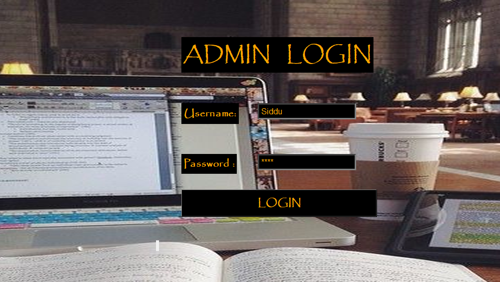
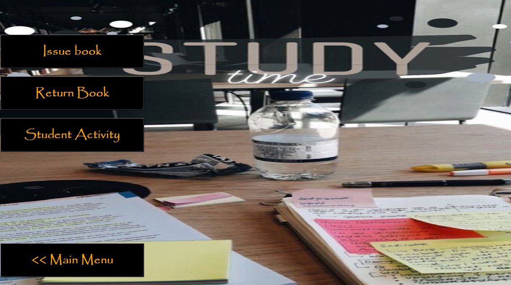

# Library-Management-System
GUI project of Library Management System in Python using Tkinter and SQL

## Functionalities  
           - add books
           - delete/update books
           - search books
           - issue book
           - return book
           - student activity
         
## Installations
Install the following packages in cmd before use.
```
pip install python-tkinter
pip install pillow
```


## Technologies used 
* Python and SQL Lite
* Tkinter for frontend


## Steps to use

  * run the Source.py file
  * usename = Source, password = root

## Screenshots

**Login Screen**



**Home Screen**


**Book Data**


**Student Data**


****Thank you!****